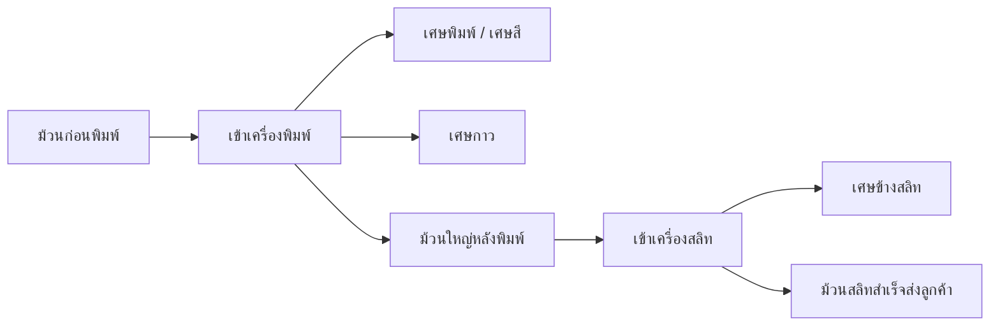
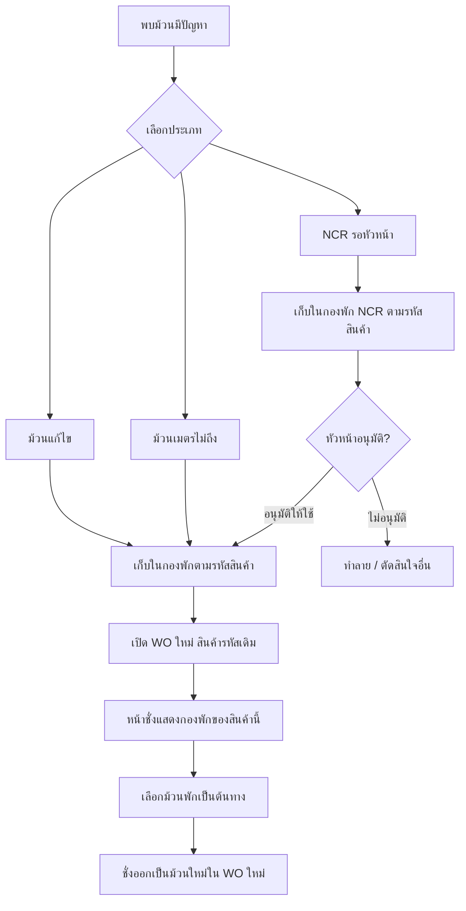

# Flow ม้วนงานพิมพ์ / สลิท / ม้วนพักแก้ไข / NCR

เอกสารนี้ใช้เป็นหลักในการจัดหน้าระบบใหม่ เพื่อให้คนชั่งไม่สับสนว่า “ม้วน 1 ม้วน” เดินทางอย่างไร และม้วนที่รอแก้ไข/NCR ต้องเก็บไว้ตรงไหน

## หลักใหญ่

- 1 WO = งานผลิต 1 งาน
- 1 SO มีได้หลาย WO
- ม้วนก่อนพิมพ์ → พิมพ์ → สลิท → ม้วนสำเร็จส่งลูกค้า
- ม้วนที่ยังใช้ไม่ได้ทันที เช่น ม้วนแก้ไข, ม้วนเมตรไม่ถึง, NCR ต้องเก็บเป็น “ม้วนพัก”
- ถ้าเปิด WO ใหม่ของสินค้ารหัสเดิม ต้องสามารถดึงม้วนพักของสินค้านั้นกลับมาใช้ใน WO ใหม่ได้

## เส้นทางม้วนปกติ

## จุดที่ต้องชั่ง

| ขั้น | ประเภทที่ชั่ง | ความหมาย | ต้องเลือกต้นทางไหม |
|---|---|---|---|
| 1 | ม้วนก่อนพิมพ์ | วัตถุดิบก่อนเข้าเครื่องพิมพ์ | ไม่ต้อง |
| 2 | เศษพิมพ์ / เศษสี | เศษเสียระหว่างพิมพ์ | ไม่ต้อง |
| 3 | เศษกาว | เศษติดกาวจากการพิมพ์ | ไม่ต้อง |
| 4 | ม้วนใหญ่หลังพิมพ์ | ม้วนที่ออกจากเครื่องพิมพ์ | ต้องเลือกว่ามาจากม้วนก่อนพิมพ์ใบไหน |
| 5 | เศษข้างสลิท | เศษข้างจากการซอย | ต้องรู้ว่ามาจากม้วนพิมพ์ใบไหน |
| 6 | ม้วนสลิทส่งลูกค้า | ม้วนเล็กที่ปริ้นใบปะหน้าส่งลูกค้า | ต้องเลือกว่ามาจากม้วนพิมพ์ใบไหน |

## ม้วนพัก

ม้วนพักคือม้วนที่ “ยังไม่จบเส้นทาง” และต้องเก็บไว้ให้เรียกกลับมาใช้ได้

| ประเภทม้วนพัก | เกิดจาก | สถานะ | เอากลับมาใช้ WO ใหม่ได้ไหม |
|---|---|---|---|
| ม้วนเมตรไม่ถึง | สลิทแล้วเมตรไม่ครบ | พักไว้รอต่อม้วน | ได้ ถ้าสินค้ารหัสเดียวกัน |
| ม้วนแก้ไข | ม้วนมีปัญหา ต้องแก้ไขภายหลัง | รอแก้ไข / รอเบิกใช้ | ได้ ถ้าสินค้ารหัสเดียวกัน |
| NCR | ม้วนรอตัดสินใจจากหัวหน้า | รอหัวหน้าอนุมัติ | ได้หลังหัวหน้าอนุมัติ |

## Flow ม้วนพักกลับเข้า WO ใหม่

## หน้าชั่งควรจัดใหม่

ให้แยกหน้าชั่งเป็นกล่องตามงานจริง ไม่ปนกัน

### 1. กล่องงานปัจจุบัน

แสดงข้อมูลหลัก:

- SO
- WO
- Lot
- เครื่องพิมพ์
- เครื่องสลิท
- รหัสสินค้า
- ชื่อลูกค้า / ชื่อสินค้า

### 2. กล่องเลือกขั้นตอนที่กำลังทำ

ใช้ปุ่มใหญ่ 3 กลุ่ม:

- พิมพ์
  - ชั่งม้วนก่อนพิมพ์
  - ชั่งเศษพิมพ์ / เศษสี
  - ชั่งเศษกาว
  - ชั่งม้วนใหญ่หลังพิมพ์
- สลิท
  - ชั่งเศษข้างสลิท
  - ชั่งม้วนสลิทส่งลูกค้า
  - ชั่งม้วนเมตรไม่ถึง
- ม้วนพัก
  - ชั่งม้วนแก้ไข
  - ชั่ง NCR
  - ดึงม้วนพักเข้ามาใช้ใน WO นี้

### 3. กล่องเลือกต้นทาง

แสดงเฉพาะตอนจำเป็น:

- ถ้าชั่ง “ม้วนใหญ่หลังพิมพ์” ต้องเลือกม้วนก่อนพิมพ์ต้นทาง
- ถ้าชั่ง “ม้วนสลิทส่งลูกค้า” ต้องเลือกม้วนใหญ่หลังพิมพ์ต้นทาง
- ถ้าชั่ง “ม้วนเมตรไม่ถึง” ต้องเลือกม้วนใหญ่หลังพิมพ์ต้นทาง
- ถ้าดึง “ม้วนพัก” มาใช้ ต้องเลือกจากกองพักของรหัสสินค้านั้น

### 4. กล่องกองพักของสินค้านี้

เมื่อเข้า WO ใหม่ ระบบควรค้นหาจาก `item_code` เดียวกัน แล้วแสดง:

- ม้วนแก้ไขที่รอใช้
- ม้วนเมตรไม่ถึงที่รอต่อ
- NCR ที่หัวหน้าอนุมัติแล้ว
- NCR ที่ยังรอหัวหน้า ให้แสดงแต่กดใช้ไม่ได้

ข้อมูลในรายการควรมี:

- WO เดิม
- Lot เดิม
- เลขม้วน
- น้ำหนัก
- เหตุผล
- สถานะ
- ปุ่ม “เลือกเป็นต้นทาง”

## กฎสำคัญกันคนใช้สับสน

- ม้วนก่อนพิมพ์กับม้วนหลังพิมพ์ ห้ามปนกับม้วนสลิท
- ม้วนสลิทส่งลูกค้าเท่านั้นที่ไปหน้าโอน
- ม้วนเมตรไม่ถึงไม่ควรไปโอน ต้องอยู่กองพัก
- ม้วนแก้ไขไม่ควรไปโอน ต้องอยู่กองพัก
- NCR ยังไม่อนุมัติ ห้ามนำไปใช้ต่อ
- ดึงม้วนพักเข้า WO ใหม่ได้เฉพาะสินค้ารหัสเดียวกัน
- ทุกม้วนที่ดึงมาใช้ใน WO ใหม่ ต้องยังเก็บ WO/Lot เดิมไว้เพื่อย้อนกลับได้

## สถานะที่แนะนำในฐานข้อมูลเดิม

ใช้ตาราง `production_rolls` เดิมได้ ไม่ต้องสร้างตารางใหม่ก่อน

| กรณี | roll_type | inbound_type | rework_status | review_status |
|---|---|---|---|---|
| ม้วนก่อนพิมพ์ | good | input_roll | null | null |
| ม้วนใหญ่หลังพิมพ์ | good | printed_jumbo | null | null |
| ม้วนสลิทส่งลูกค้า | good | slit_roll | null | null |
| ม้วนเมตรไม่ถึง | good | short_meter | pending | null |
| ม้วนแก้ไข | bad | internal | pending | null |
| NCR รอหัวหน้า | bad | ncr | null | pending_review |
| NCR อนุมัติให้แก้ไข | bad | ncr | pending | approved_rework |
| ม้วนพักถูกนำไปใช้แล้ว | bad/good | เดิม | reworked | null/approved_rework |

## ข้อความบนหน้าจอที่ควรใช้

- “กำลังชั่งม้วนก่อนพิมพ์”
- “กำลังชั่งม้วนใหญ่หลังพิมพ์ — เลือกม้วนก่อนพิมพ์ต้นทางก่อน”
- “กำลังชั่งม้วนสลิท — เลือกม้วนพิมพ์แล้วต้นทางก่อน”
- “กองพักของสินค้านี้ — ใช้ได้เฉพาะรหัสสินค้าเดียวกัน”
- “NCR รอหัวหน้า — ยังนำมาใช้ไม่ได้”
- “ม้วนนี้ถูกดึงมาใช้ใน WO นี้แล้ว”

## สรุปแบบสั้น

หน้าชั่งใหม่ควรคิดเป็น 4 ส่วน:

1. งานนี้คือ SO/WO/Lot อะไร
2. ตอนนี้กำลังชั่งขั้นตอนไหน
3. ถ้าขั้นตอนนี้ต้องมีต้นทาง ให้เลือกต้นทางก่อน
4. ถ้ามีม้วนพักของสินค้านี้ ให้เลือกดึงกลับมาใช้ใน WO ใหม่ได้

